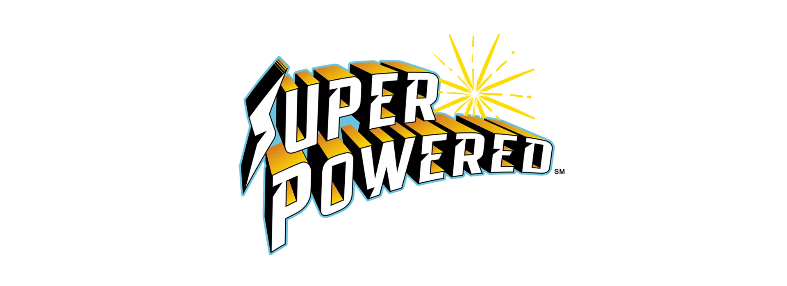

# Project Description

This repository contains the MicroPython code for our EV3 robot that we used during competition.  Though EV3 has been officially retired, we hope this repository can be helpful to other FIRST Lego League teams that are exploring Python-based development.

# Repository Organization 
- _src_ :  All of the source code
  
    * missions.py :  Mission-specific code 
    * robot.py    :  Robot navigation 
    * main.py     :  Launch and menu 
  
- _tests_ : Miscellaneous functionality tests

